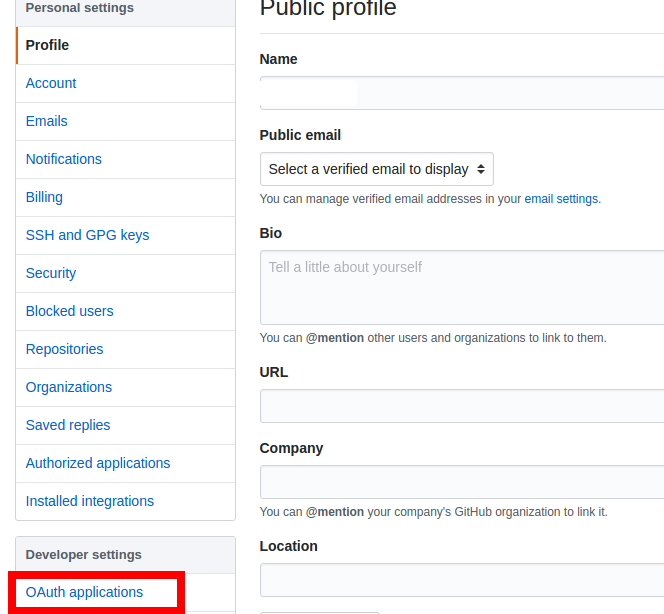
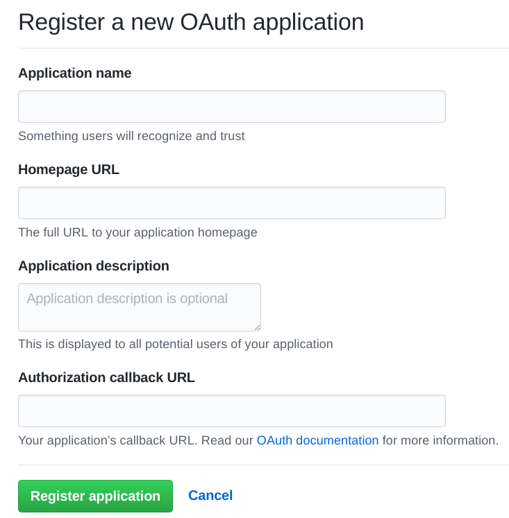
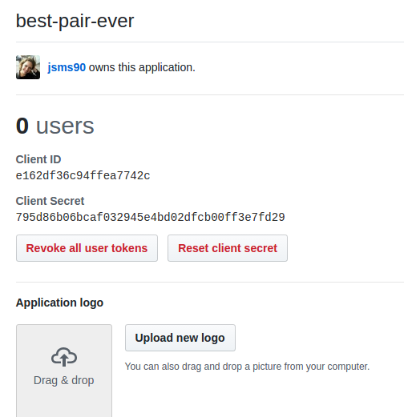

## Step 3 - Register your app

Github needs to know about your app before it will let you authenticate users with it.

Swap driver & computer again. But there's no need to raise a new github issue this time. We're not going to write any code that's getting pushed up.

1. On Github, click on the arrow by your picture in the top right-hand corner. Click on "Settings" to your profile settings.

2. Then click on "OAuth applications"  

3. Now register the app you are creating:  
  + Click the "Register new application" button, and you will see this screen:
  
  + `Application Name`: Call it what you like (but it generally makes sense for it to be the same name as your repo).  
  + `Homepage url`: type your `BASE_URL` (e.g. `https://localhost:3000` - if you completed step 2, don't forget the 's' in 'https')  
  + `Application description`: you can leave it blank for this workshop, but you might want to be descriptive when you create an actual project
  + `Authorization callback url`: type your `BASE_URL` + `/welcome` (e.g. `https://localhost:3000/welcome`)  
  

4. Add 2 new variables to your `config.env`: `CLIENT_ID` and `CLIENT_SECRET`, taken from your app page on github.  
Remember: you need to preface these lines in your `config.env` with "export" (not "export**s**")  
> export CLIENT_ID=letters1234and5678numbers  

[Step 4](./step4.md)
