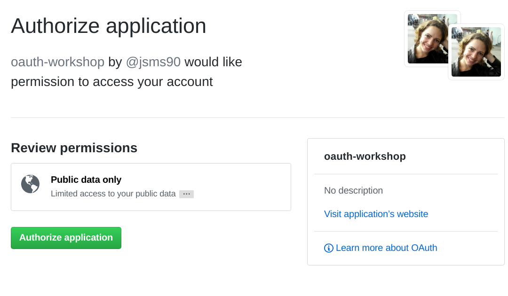

## Step 4 - Create your login route with Github OAuth

Raise a new issue on your project called `create login route with Github OAuth` and commit against that. (This will be the last time you are prompted to raise Github issues. It is expected that you will continue doing this with each new step of the workshop.)

+ When a user goes to our login url, this begins the OAuth workflow. We need to handle this request.

  + In your hapi server, start by writing a new route.
  + Let's get into good habits, and start modularising our code straight away. Create a directory called `routes`.
  + Start writing a new route whose method is `GET` and whose path (a.k.a. endpoint) is `/login`.

The handler for this route needs to redirect the user straight to Github. Then the user can give their consent to our application having certain, limited access to their Github account. It is up to the 3rd party (in this case, Github) to decide which permissions are given as part of this OAuth procedure. But these permissions are displayed for consent by the user.

It is up to the user to look through the list of permissions, and consent / not consent to this sharing of details.

+ Fill in the handler for this route:
  + Find out the Github url that your app needs to query, by looking in the docs of the 3rd party application that you're using  
  [Here are the Github API docs again](https://developer.github.com/v3/oauth/#web-application-flow)  
  Note: The only parameter you _need_ to pass is the `client_id`, but check out the optional parameters that you have too.
  + You will need to use hapi's [`reply.redirect`](https://hapijs.com/api#replyredirecturi) method

+ Test your route with [`server.inject`](https://hapijs.com/api#serverinjectoptions-callback)

Helpful tip: you can use a native module called [`querystring`](https://nodejs.org/api/querystring.html) to build your query.

Run your server and go to `https://localhost:3000/login`. If your route is written correctly, you should see:

Go to [step 5](./step5.md) to handle the endpoint you will be sent to if you click "Authorize application".
